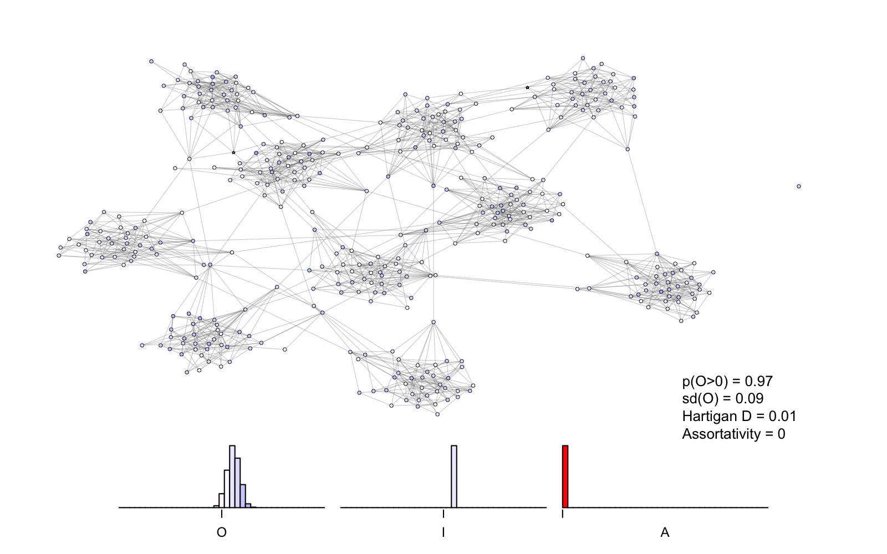

# HIOM
R code for "The polarization within and across individuals: the hierarchical Ising opinion model"

Polarization of opinions is a societal threat. It involves psychological processes as well as group dynamics, a popular topic in statistical physics. However, the interaction between the within individual dynamics of attitude formation and across person polarization is rarely studied. By modelling individual attitudes as Ising networks of attitude elements, and approximating this behaviour by the cusp singularity, we developed a fundamentally new model of social dynamics. In this hierarchical model agents behave either discretely or continuously depending on their attention to the issue. At the individual level the model reproduces the mere thought effect and resistance to persuasion. At the social level the model implies polarization and the persuasion paradox. We propose a new intervention for escaping polarization in bounded confidence models of opinion dynamics. 

How to run
----------
Run code in Rstudio
Install packages specified in  HIOM_SW.r

Main simulation is HIOM_SW.r (figures 4,5,6,7,8)

figures2&3.r produces figure 2 and 3

figureA1.r produces figure in Appendix A

